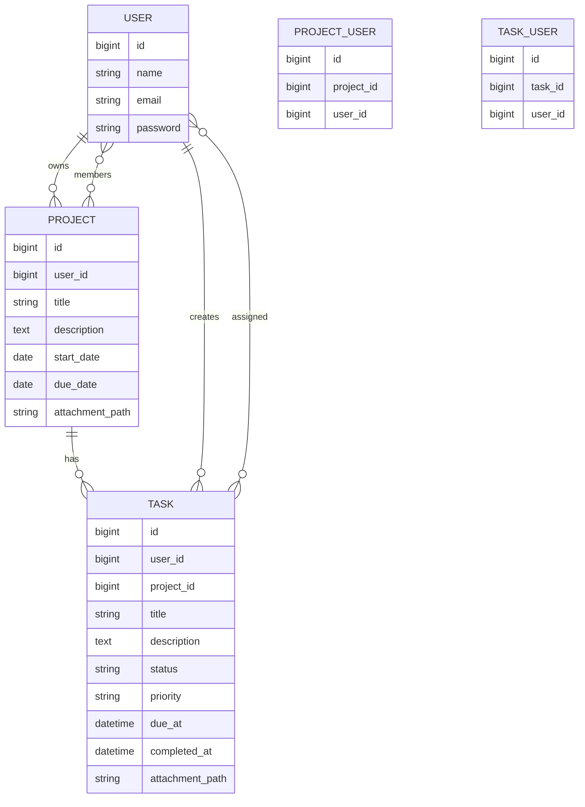
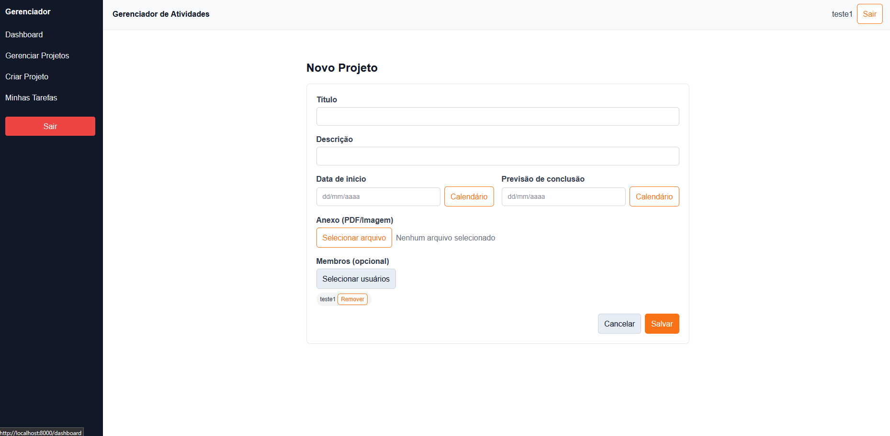
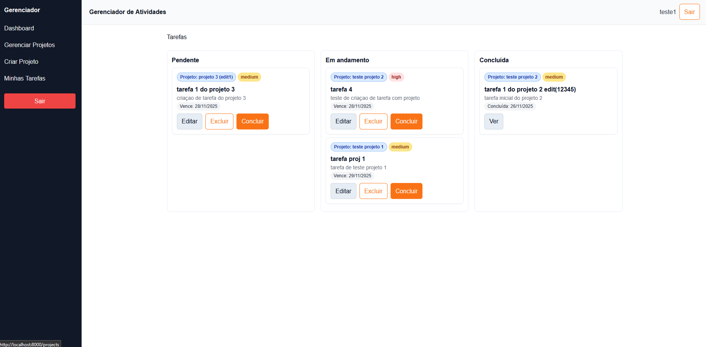
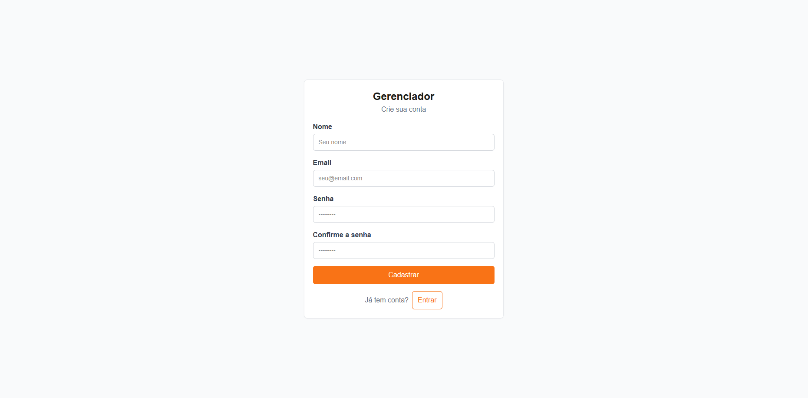
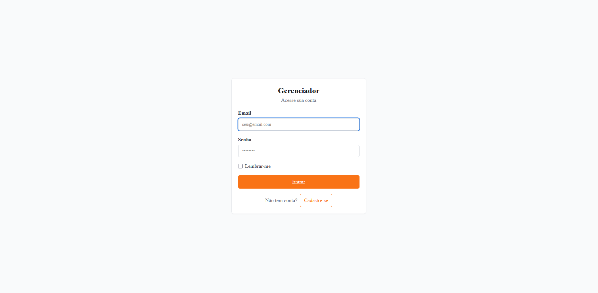

# Gerenciador de Atividades (Laravel + Inertia + Vue 3)

Aplicação para gerenciamento de projetos e tarefas, com controle de membros por projeto, tarefas pessoais, anexos em PDF, filtros por status e prioridade, e interface SPA via Inertia.

## Tecnologias
- Laravel 12 (PHP 8.4)
- Inertia.js + Vue 3
- Vite
- MySQL (padrão) ou SQLite (alternativa via `.env`)
- Ziggy (rotas no front)

## Recursos
- Projetos: criar, editar, excluir, anexar PDF/Imagem, datas de início e previsão
- Membros de projeto: adicionar/remover (owner e membros têm acesso às tarefas do projeto)
- Tarefas do projeto: criar, editar, excluir, atribuir membros, vencimento, status
- Tarefas pessoais: CRUD completo, filtros por status/prioridade, anexar PDF, concluir tarefa

## Instalação e Execução
1. Instale dependências
   - `composer install`
   - `npm install`
2. Configure o ambiente
   - Copie `.env.example` para `.env` e ajuste variáveis
   - Gere a chave: `php artisan key:generate`
   - MySQL (padrão):
     - Defina no `.env`:
       - `DB_CONNECTION=mysql`
       - `DB_HOST=127.0.0.1`
       - `DB_PORT=3306`
       - `DB_DATABASE=gerenciador`
       - `DB_USERNAME=seu_usuario`
       - `DB_PASSWORD=seu_password`
     - Criar banco:
       - CLI: `mysql -u <usuario> -p -e "CREATE DATABASE gerenciador CHARACTER SET utf8mb4 COLLATE utf8mb4_unicode_ci;"`
       - SQL: `CREATE DATABASE gerenciador CHARACTER SET utf8mb4 COLLATE utf8mb4_unicode_ci;`
   - SQLite (alternativa):
     - Crie o arquivo: `mkdir database && type NUL > database\database.sqlite` (Windows)
      - Linux/macOS: `mkdir -p database && touch database/database.sqlite`
     - Defina no `.env`:
       - `DB_CONNECTION=sqlite`
       - `DB_DATABASE=database/database.sqlite`
3. Migrações
   - `php artisan migrate --force`
4. Rodar em desenvolvimento
   - Backend: `php artisan serve --host=localhost --port=8000`
   - Frontend: `npm run dev`
5. Acesso
   - Abra `http://localhost:8000/` e faça login/cadastro

## Scripts de Inicialização
- Windows (PowerShell):
  - `powershell -ExecutionPolicy Bypass -File scripts/start-dev.ps1 -Port 8000`
  - Abre dois terminais: backend em `http://127.0.0.1:8000` e frontend em `http://localhost:5173`. Pressione Enter para encerrar ambos.
- Linux/macOS:
  - `chmod +x scripts/start-dev.sh`
  - `./scripts/start-dev.sh`
  - Inicia backend e frontend; encerre com `Ctrl+C`.

Pré-requisitos: PHP 8.4+, Composer, Node.js (npm) instalados e dependências do projeto (`composer install` e `npm install`).

## Estrutura de Dados (Tabelas)
- `users`
  - `id`, `name`, `email`, `password`, `timestamps`
- `projects`
  - `id`, `user_id` (owner), `title`, `description`, `start_date`, `due_date`, `attachment_path`, `timestamps`
- `tasks`
  - `id`, `user_id` (criador), `project_id` (nullable), `title`, `description`, `status` (pending|in_progress|completed), `priority` (low|medium|high), `due_at`, `completed_at`, `attachment_path`, `timestamps`
- `project_user` (membros do projeto)
  - `id`, `project_id`, `user_id`, `timestamps`, `unique(project_id,user_id)`
- `task_user` (atribuições de usuários às tarefas)
  - `id`, `task_id`, `user_id`, `timestamps`, `unique(task_id,user_id)`

## Regras de Acesso
- Somente owner e membros de um projeto podem ver/gerenciar as tarefas do projeto
- Tarefas pessoais são visíveis e gerenciáveis apenas pelo seu criador (`user_id`)

## Rotas Principais
- Projetos
  - `GET /projects` lista
  - `POST /projects` cria
  - `PUT /projects/{project}` atualiza
  - `DELETE /projects/{project}` exclui
  - `POST /projects/{project}/members` adiciona membro
  - `DELETE /projects/{project}/members/{user}` remove membro
  - `GET /projects/{project}/tasks` tarefas do projeto
- Tarefas Pessoais
  - `GET /tasks` lista com filtros
  - `GET /tasks/create` formulário de criação (pode associar a um projeto)
  - `POST /tasks` cria (upload PDF em `public/storage/task_attachments`) e aceita opcionalmente `project_id` para vincular ao projeto
  - `GET /tasks/{task}/edit` edição
  - `PUT /tasks/{task}` atualiza
  - `DELETE /tasks/{task}` exclui
  - `POST /tasks/{task}/complete` marca como concluída

## DER (Diagrama de Entidades e Relacionamentos)

Notas:
- Chaves únicas em tabelas pivot (`project_user`, `task_user`) foram omitidas no diagrama por limitação de sintaxe do Mermaid. Elas existem no banco via índice único composto.

## Observações
- Uploads de tarefas são salvos em `public/storage/task_attachments` (acesso via `/storage/task_attachments/<arquivo>.pdf`).
- Formatação de datas no front padronizada para `dd/mm/aaaa`.
- Usuários de teste (banco pré-criado):
  - `teste1@teste.com` / senha: `senhateste`
  - `teste2@teste.com` / senha: `senhateste`

## Futuras Melhorias
- Otimização do visual geral
- Cards com visual mais amigável
- Melhorar a animação dos cards ao serem arrastados

## Capturas de Tela
- Novo Projeto
  - 
  - Formulário para criar projeto com título, descrição, datas, anexo (PDF/Imagem) e seleção de membros.
- Lista de Projetos
  - 
  - Tabela com início, previsão, anexo e ações: Tarefas, Editar, Excluir e criação de novo projeto.
- Minhas Tarefas (Kanban)
  - 
  - Colunas por status: Pendente, Em andamento e Concluída. Botões para editar, concluir, excluir e ver anexos.
- Cadastro
  - 
  - Tela para criar conta com nome, email, senha e confirmação.
- Login
  - 
  - Acesso com email e senha, opção lembrar-me e atalho para cadastro.

Observação: salve as imagens nas rotas indicadas em `docs/screenshots/` para exibir no GitHub.
